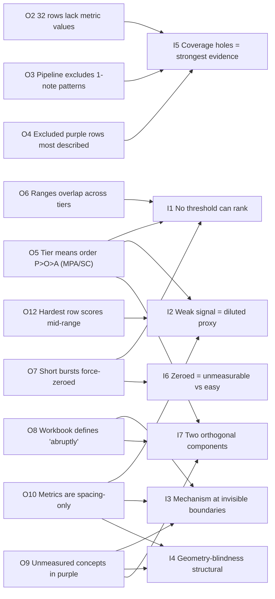
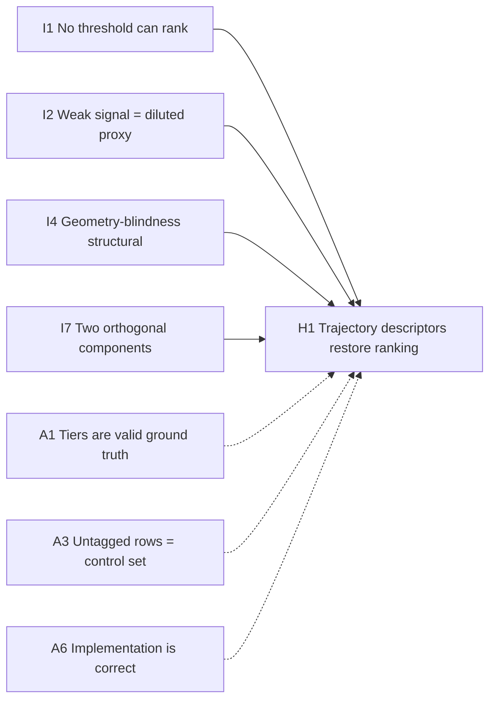
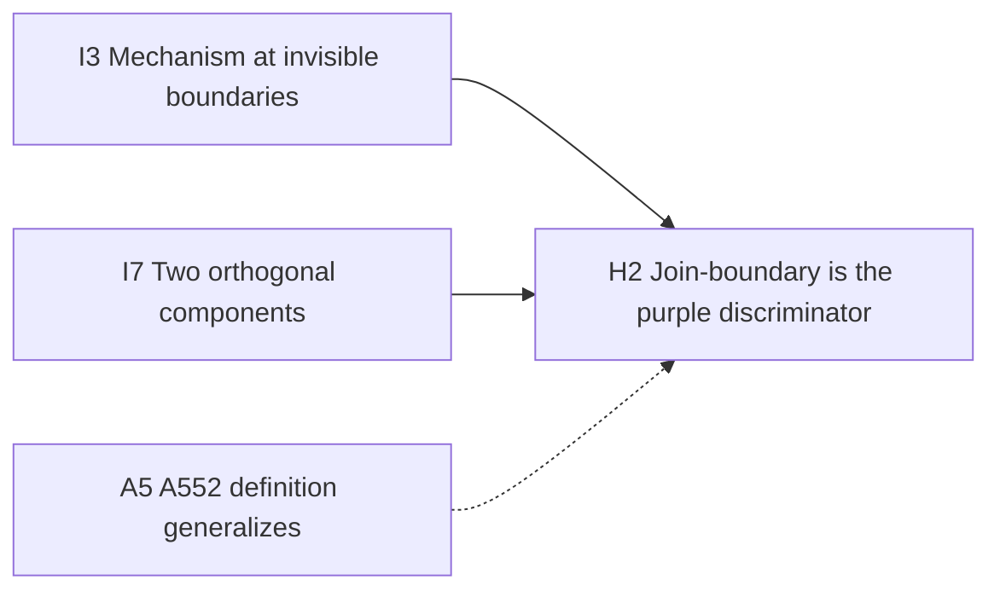
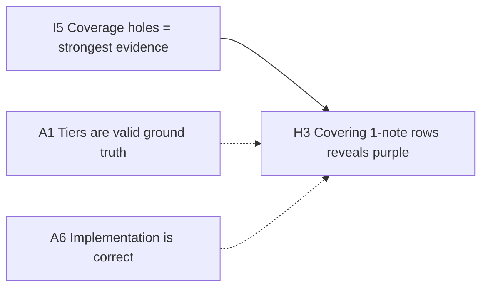
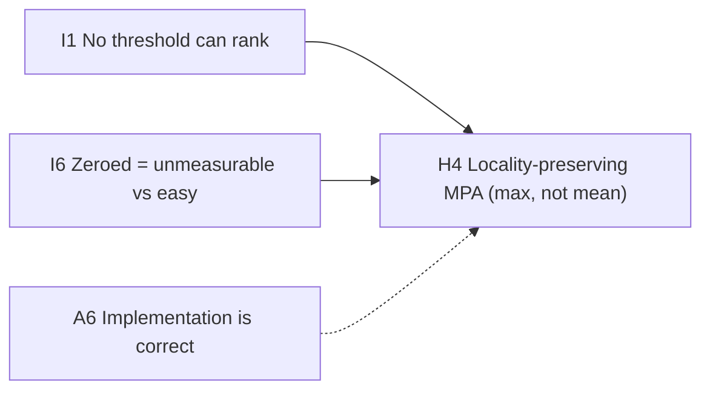
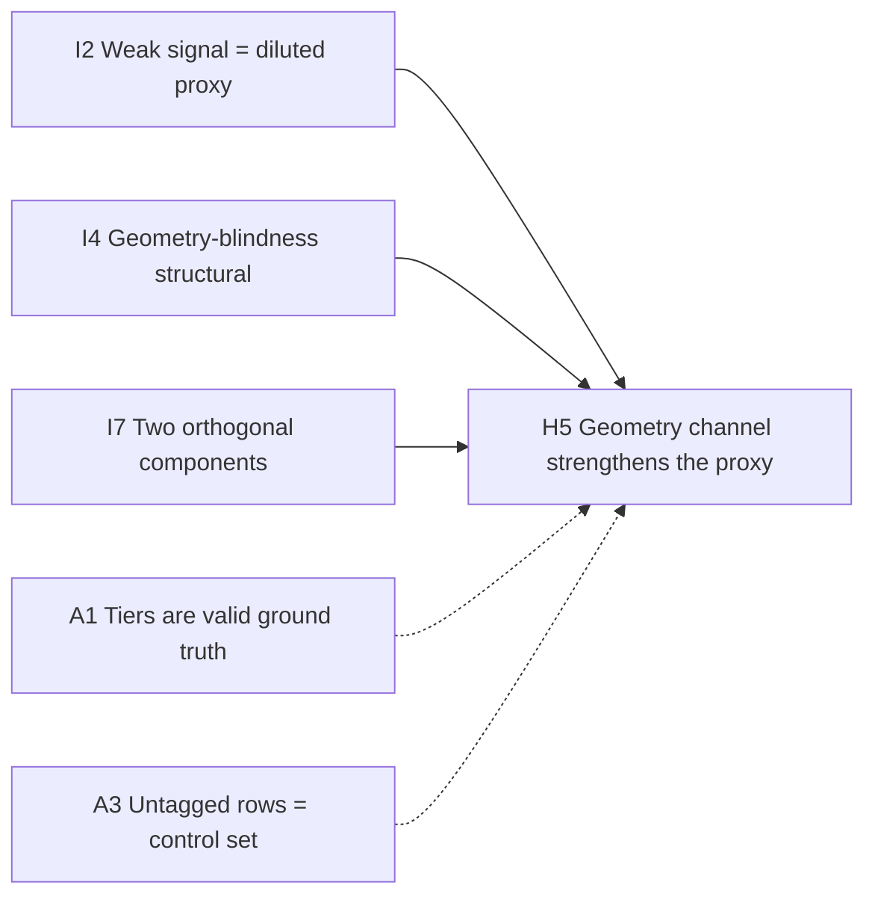
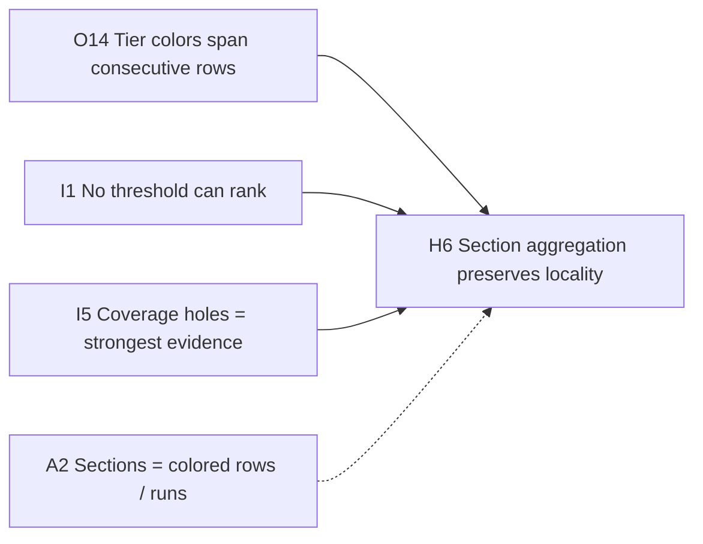
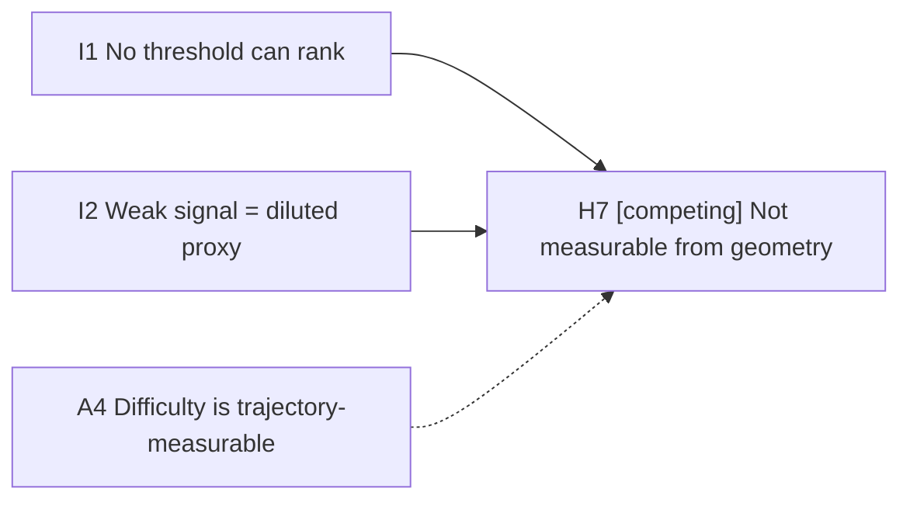

# OIAH — Motor adjustment plan (MM/MPA/SC) vs tiered reading difficulty

Methodology per `Temp/OIAH definitions & pipeline.md` ("Experiment Reasoning Framework"): four strictly distinct categories; every Inference/Assumption/Hypothesis traces to ≥1 Observation; many-to-many; downgrade rather than upgrade; no invented upstream evidence.
Conventions: Obs./Inf./Asp./Hyp. per user instruction. Success criterion (user-dictated): metrics must reproduce the purple > orange > aqua tier ranking of sections; hypotheses are open to new metrics beyond MM/MPA/SC.

Sources: `Prototyping/yoasobi_collab_extra_motor_patterns (success criteria here).xlsx` (sheet `Patterns`, rows 2–552; tiers by cell fill only), `backend/src/analysis/reading/sequence_motor.rs` + `reading/mod.rs`, wiki pages [[sequence-motor]], [[motor-model-requirements]], [[reading-analysis]], `wiki/wiki/log.md` (entries 203, 206, 229), Phase 1/2 reader extraction reports (Temp `criteria_xlsx_full_dump.txt`, `tiered_rows_table.txt`).

---

## Observations

### Obs.1 — Tier structure exists as cell fill only
- **Observation**: 85 of 552 pattern rows carry a tier color (purple 22, orange 33, aqua 30); tiers are represented solely by cell fill on columns A/B, with no legend, title, or tier text anywhere in the workbook.
- **Evidence**: openpyxl fill extraction; theme mapping purple theme#7 `CCC1DA`, orange theme#9 `FCD5B5` (rows 56–57 a lighter tint, accident), aqua theme#8 `B7DEE8`.
- **Source**: Excel extraction (Temp/tiered_rows_table.txt).

### Obs.2 — 32 of 85 tiered rows have no metric values at all
- **Observation**: 32 tiered rows (purple 7, orange 15, aqua 10) have empty MPA/MM/SC cells; all are 1-note Jump or Slider rows.
- **Evidence**: per-tier stats; no-value rows purple {276, 303, 343, 364, 367, 512, 514}, orange {57, 197, 251, 264, 337, 352, 358, 360–363, 491–494}, aqua {135, 136, 256, 270, 379, 434, 436, 483, 484, 532}.
- **Source**: Excel columns G/H/I.

### Obs.3 — The pipeline excludes 1-note patterns by construction
- **Observation**: `sequence_motor` includes only ≥2-note patterns: singletons are skipped (`sequence_motor.rs:186-188`), timeline only ≥2-note patterns (`sequence_motor.rs:44`).
- **Evidence**: code inspection (Phase 1 reader).
- **Source**: `backend/src/analysis/reading/sequence_motor.rs`.

### Obs.4 — The excluded purple rows are among the most explicitly described
- **Observation**: 4 of the 7 purple no-value rows carry descriptor text in column C describing their difficulty: r343 ("half stacked line then abruptly connect to another triple stack… then acruptly into a diagonal"), r364 ("wiggle… then a curve that self-overlap when hitting the slider head"), r367 ("abruptly from top to bottom… self-overlap when going to hit the first stacked doubles"), r512 ("spiral… self-overlap trajectory").
- **Evidence**: descriptor table, purple rows 343, 364, 367, 512.
- **Source**: Excel column C.

### Obs.5 — Tier means order purple > orange > aqua for MPA and SC, not MM
- **Observation**: MPA means 0.519 / 0.316 / 0.291 (P/O/A); SC means 0.300 / 0.245 / 0.200; MM means 0.978 / 0.956 / 0.870 (near-flat).
- **Evidence**: per-tier stats (rows with values; n=15/18/20).
- **Source**: Phase 2 reader stats from Excel.

### Obs.6 — Value ranges overlap across all three tiers
- **Observation**: 3-way range overlap: MPA 0.000–0.993, MM 0.282–1.609, SC 0.000–0.591; orange MPA max (1.581) exceeds purple max (1.446); aqua MM min (0.282) below purple MM min.
- **Evidence**: min..max per tier per metric.
- **Source**: Phase 2 reader stats from Excel.

### Obs.7 — Short bursts can score 0/0/0 while describing real difficulty
- **Observation**: purple r301 (2n burst, "spiral with slightly increase and then decrease in spacing with self-overlap") and orange r139 (2n burst, "flat wiggle… spacing increment is bigger") both score MPA 0.000 / MM 0.000 / SC 0.000. MPA is 0.0 for patterns with <4 notes by construction (`sequence_motor.rs:84`, k≥3).
- **Evidence**: Excel rows 301, 139; code.
- **Source**: Excel columns G/H/I; `sequence_motor.rs`.

### Obs.8 — The workbook defines "abruptly" as the difficulty mechanism
- **Observation**: The workbook's only in-file difficulty definition (cell A552): by "abruptly" = minor sections within a stream don't smoothly connect, broken in purpose, requiring a sudden motor adjustment to reset the cursor to the first note of the next minor section, under the same BPM snapping window — "more motor adjustment under same hit window, therefore this 'abrupt' part makes the pattern harder".
- **Evidence**: verbatim cell A552 text.
- **Source**: Excel cell A552.

### Obs.9 — Unmeasured concepts concentrate in the purple tier
- **Observation**: concept tags over the 51 descriptors: abrupt/join-break 10 rows (P5/O4/A1); self-overlap 9 rows (P5/O4/A0); direction-turn 14 rows (P7/O3/A4); stacked 10 rows (P6/O3/A1).
- **Evidence**: mechanical concept tagging of column C texts (fixed vocabulary).
- **Source**: Phase 2 reader tag table.

### Obs.10 — The three metrics are spacing-only aggregates
- **Observation**: MPA/MM/SC are computed solely from the spacing sequence (Euclidean distance between consecutive notes, normalized by circle diameter): mean absolute second difference (MPA), RMS (MM), coefficient of variation (SC). No angle, direction, or shape input anywhere in the computation.
- **Evidence**: `sequence_motor.rs:72-112`; normalization `reading/mod.rs:12-14`.
- **Source**: code inspection (Phase 1 reader).

### Obs.11 — Untagged rows also carry metric values
- **Observation**: 193 of 552 rows have MPA/MM/SC values; of these, 53 are tiered and 140 are plain (untagged). Every valued row has all three metrics filled.
- **Evidence**: coverage stats (G/H/I identical row sets).
- **Source**: Phase 2 reader stats from Excel.

### Obs.12 — Wiki records: hardest section scores mid-range; metrics near-orthogonal
- **Observation**: wiki log records the "hardest" section (S042 = purple r542, "the hardest: spaced diagonal/spiral…") at MPA 0.358 / MM 0.952 while untagged rows reach MPA 4.7 — no obvious separation; MPA/MM near-orthogonal (Signal r=0.125, YOASOBI r=0.286), MPA/SC partially shared (0.56 / 0.50).
- **Evidence**: `wiki/wiki/log.md` entries 203, 229; Excel row 542.
- **Source**: wiki log; Excel.

### Obs.13 — Descriptor wording is unnormalized
- **Observation**: the workbook uses multiple verbatim variants for the same concept: abruptly/acruptly; zig-zag/zig zag; anti-clockwise/anticlockwise; flatten/flatter/flat/spreaded wiggle family; plus typos (increse, sligtly, go pass) and self-references ("mentioned before", no index).
- **Evidence**: verbatim descriptor dump (Temp/criteria_xlsx_full_dump.txt).
- **Source**: Excel column C.

### Obs.14 — Tier colors often span consecutive rows
- **Observation**: tier color frequently covers a run of adjacent pattern rows executed in sequence: purple runs {275,276}, {301–303}, {343,344}, {364,365}, {367,368}, {512–514}; orange runs {56,57}, {139,140}, {196,197}, {250,251}, {263,264}, {337,338}, {352,353}, {358–363}, {419,420}, {491–494}; aqua runs {134–136}, {256,257}, {269,270}, {323,324}, {378,379}, {434–436}, {482–484}, {531,532}. The rest are single-row tags.
- **Evidence**: row layout of tiered rows in the workbook (adjacency of same-fill rows).
- **Source**: Excel extraction; user statement (2026-08-13): "a colour tag is based on multiple rows executed in a sequence, it's similar to those 51 test sample notes".

---

## Inferences

### Inf.1 — No threshold or weighting of the triple can rank tiered rows
- **Inference**: with ranges overlapping across all tiers and short patterns force-zeroed, no MPA/MM/SC threshold, ranking, or fixed weighting can separate purple from aqua rows.
- **Confidence**: high
- **Based on**: Obs.5, Obs.6, Obs.7

### Inf.2 — The weak tier signal is a diluted proxy, not the mechanism
- **Inference**: the ordering visible in tier means (MPA/SC) is consistent with spacing variability being correlated with difficulty rather than being the difficulty mechanism itself — a diluted proxy (wiki AA1: angle/spacing correlated-not-causative).
- **Confidence**: high
- **Based on**: Obs.5, Obs.10, Obs.12

### Inf.3 — The defined difficulty mechanism lives at boundaries the metrics cannot see
- **Inference**: the workbook defines hard as abrupt joins between minor sections (Obs.8), and such join descriptions concentrate in purple (Obs.9), but the metrics are per-pattern spacing aggregates computed inside one atomic window (Obs.10) — the metric vocabulary has no concept of a join or boundary, so the defined mechanism is structurally unmeasured.
- **Confidence**: high
- **Based on**: Obs.8, Obs.9, Obs.10

### Inf.4 — Geometry-blindness is structural, not a tuning problem
- **Inference**: self-overlap (P5/O4/A0) and direction-turn (P7/O3/A4) are difficulty markers with a purple gradient, yet they are unmeasurable from spacing-only inputs — augmenting weights or thresholds cannot capture what the inputs never contain.
- **Confidence**: medium (tag counts are from 51 descriptors of 85 rows; 34 rows have no descriptor text)
- **Based on**: Obs.9, Obs.10

### Inf.5 — Coverage holes coincide with the highest-contrast evidence
- **Inference**: the ≥2-note exclusion removes exactly the rows whose descriptors describe the hardest reading (Obs.4) — the purple tier's evidence is most visible where the metrics are absent, so the system is blind where the user's signal is strongest.
- **Confidence**: high
- **Based on**: Obs.2, Obs.3, Obs.4

### Inf.6 — Force-zeroed patterns conflate "unmeasurable" with "easy"
- **Inference**: short bursts scoring 0/0/0 despite difficulty descriptors is consistent with the metrics treating them as indistinguishable from trivial patterns — any ranking built on these values would misplace r301/r139 at the easy end.
- **Confidence**: medium
- **Based on**: Obs.7

### Inf.7 — Difficulty appears to have at least two orthogonal components
- **Inference**: the data is consistent with reading difficulty decomposing into at least two signals: within-pattern spacing variability (partially captured by MPA/SC) and cross-boundary motor-reset demand (captured by nothing). MM adds scale, not the missing difficulty channel.
- **Confidence**: medium
- **Based on**: Obs.5, Obs.8, Obs.9

---

## Assumptions

### Asp.1 — The color tiers are valid ground-truth labels with consistent ordering
- **Assumption**: the purple > orange > aqua tags encode a real, consistent reading-difficulty ordering across rows, sufficient to serve as the reference for a metric ranking.
- **Why it matters**: the entire success criterion ("reproduce the tier ranking") treats the tags as ground truth; if tags are noisy or order-inconsistent, the criterion is ill-posed.
- **Evidence status**: partially supported (user's ranking authority; r542 self-describes as "the hardest" — Obs.12; no in-file legend and no intra-tier ordering — Obs.1).

### Asp.2 — "Sections" are the colored rows; a tag may cover a run of consecutive rows
- **Assumption**: the units the user ranks ("sections") are the colored rows of the workbook; where several consecutive rows share one color, they are one section executed in sequence (user-confirmed 2026-08-13: "section means the coloured row, sometime a colour tag is based on multiple rows executed in a sequence, it's similar to those 51 test sample notes we did before"). The ranking unit is therefore the section = a colored row, or an adjacent same-color run (Obs.14).
- **Why it matters**: the metric evaluation unit must be the section, not the atomic pattern: for run-sections, per-pattern values aggregate within the run (locality question, Hyp.6), and cross-row boundaries inside a run are where the abrupt/join mechanism (Hyp.2, A552) operates — the same-row reading of r294's "made up by minor sections" (a 36-note stream tagged with one color) remains consistent with this.
- **Evidence status**: supported (user statement 2026-08-13 + workbook run layout Obs.14).

### Asp.3 — Untagged rows are a valid control set
- **Assumption**: the 460 untagged rows represent baseline difficulty (the control set per Q3), not merely rows the user did not get around to tagging.
- **Why it matters**: comparisons against untagged values (e.g. Obs.12's "untagged reach 4.7") and the evaluation design treat them as control; if tagging was selective, the control is contaminated with hard rows.
- **Evidence status**: partially supported (Q3 decision designates them control; selection may have been notable-parts-only).

### Asp.4 — Difficulty is expressible as a function of measurable trajectory quantities
- **Assumption**: reading difficulty can, in principle, be modeled from measurable pattern/trajectory features (spacing, angles, turns, joins, overlaps).
- **Why it matters**: if difficulty is dominated by irreducible perceptual factors, the success criterion is unreachable and Hyp.7's revision path applies.
- **Evidence status**: unsupported — this is the research question itself (validation-first stance).

### Asp.5 — The A552 "abrupt" definition generalizes across tiers
- **Assumption**: the A552 definition of "abruptly" is the user's general difficulty model (harder = more motor adjustment under the same hit window), applying across tiers and pattern types, not a comment about one row.
- **Why it matters**: Hyp.2 (join-boundary metric) builds directly on it; if the definition is local to streams, the join hypothesis needs re-scoping.
- **Evidence status**: partially supported (note is phrased generally, "this 'abrupt' part makes the pattern harder"; it is a single in-file statement).

### Asp.6 — The metric implementation is correct per its formulas
- **Assumption**: sequence_motor's computed values faithfully implement the documented formulas; the diagnostic targets the model, not a bug.
- **Why it matters**: all observations citing Excel values (Obs.2, 5–7) and the wiki's no-separation record depend on the numbers being trustworthy.
- **Evidence status**: supported (canary pattern counts match production — log.md:206; earlier session verification).

---

## Hypotheses

### Hyp.1 — Trajectory descriptors restore row-level tier ranking
- **Hypothesis**: if the metric set is augmented with trajectory descriptors (turn-sign sequence sᵢ ∈ {+, −, 0}, shape-segment labels, self-overlap flags), then row-level ranking of the 85 tiered rows reproduces purple > orange > aqua (minimum bar per Q3: purple all harder than aqua), under the current pattern segmentation.
- **Prediction**: tier separation (e.g. rank-overlap or separation score) improves materially over the spacing-only triple; the "hardest" rows (r542 and the described abrupt rows) no longer sit mid-range.
- **Test**: compute descriptors on the yoasobi patterns (feasibility precedent: aim_control `vectors.rs` flip/chirp/alignment primitives — 2026-08-12 handoff H10); evaluate against the 85-row tiered set.
- **Falsifier**: no significant improvement over MPA/MM/SC alone, or r542-class rows still rank mid-range.
- **Based on**: Inf.1, Inf.2, Inf.4, Inf.7; Asp.1, Asp.3, Asp.6

### Hyp.2 — Join-boundary discontinuity is the purple-tier discriminator
- **Hypothesis**: if the join between minor sections is measured (spacing/angle discontinuity at pattern boundaries, i.e. cursor-reset demand per the A552 definition), then abrupt-tagged rows score highest on join demand — including separating within-tier (abrupt purple r157/r215 vs non-abrupt purple r411) — under the same-snap-window rule.
- **Prediction**: join-demand scores rank abrupt rows (r157, 212, 215, 343, 367) above non-abrupt rows of the same tier; adds separation beyond Hyp.1's within-pattern descriptors.
- **Test**: implement boundary-discontinuity features (HH1 fork: geometry descriptors vs physics Δv at boundaries); score the 85 rows; compare abrupt vs non-abrupt within tier.
- **Falsifier**: abrupt rows do not separate from non-abrupt rows of the same tier, or join features add no separation over Hyp.1.
- **Based on**: Inf.3, Inf.7; Asp.5

### Hyp.3 — Covering the excluded 1-note rows reveals the hardest purple evidence
- **Hypothesis**: if 1-note Jump/Slider rows enter measurement (slider-waypoint model or neighbor-context trajectory features), then the currently invisible purple rows (343, 364, 367, 512) rank among the hardest in the tier set.
- **Prediction**: those four rows score above the purple-tier median once measurable; tier coverage rises from 53/85 to 85/85.
- **Test**: compute trajectory features for the 32 excluded rows (slider head/body/tail + adjacent note context; wiki notes the slider-waypoint model is currently deferred — rhythm-segmentation.md:105); check their rank against the tier distribution.
- **Falsifier**: included rows rank mid/low — exclusion is not the source of the mismatch, or the features are uncomputable from current data.
- **Based on**: Inf.5; Asp.1, Asp.6

### Hyp.4 — Locality-preserving MPA (max, not mean) rescues short patterns
- **Hypothesis**: if MPA's length-averaging is replaced by a locality-preserving statistic (max or p95 of the absolute second differences), then force-zeroed/underweighted short patterns register nonzero values and rank above trivial rows.
- **Prediction**: r301/r139 (currently 0/0/0) get nonzero MPA-type values; within-tier ordering of purple improves.
- **Test**: compute max-|Δ²| variant on the yoasobi patterns; compare zeroed rows and tier separation vs mean-MPA.
- **Falsifier**: the zeroed rows remain ≈0 (their spacing genuinely uniform at the measurable scale — difficulty lives in unmeasured geometry, not spacing curvature), or no ranking improvement.
- **Based on**: Inf.1, Inf.6; Asp.6

### Hyp.5 — Adding the geometry channel strengthens the proxy (AA1 path)
- **Hypothesis**: if geometry-correlated features (angle/turn structure) are added alongside the spacing features, then the proxy's tier signal strengthens enough to reproduce the ranking — the spacing channel is salvageable rather than replaceable.
- **Prediction**: spacing+geometry features separate tiers better than spacing-only; MPA/SC keep their ordering contribution.
- **Test**: add angle/turn features to the triple; compare tier separation vs spacing-only (directly tests AA1's "diluted proxy" softening).
- **Falsifier**: no improvement over spacing-only — the proxy is not salvageable, and Hyp.1's replacement path is required.
- **Based on**: Inf.2, Inf.4, Inf.7; Asp.1, Asp.3

### Hyp.6 — Section aggregation must preserve locality
- **Hypothesis**: if section-level scoring uses locality-preserving aggregation (max/p95 over the section's patterns, where a section = a colored row or an adjacent same-color run per Asp.2/Obs.14) instead of mean, then section ranking reproduces the tier ordering better.
- **Prediction**: concentrated difficulty (short hard patterns inside longer sections or runs) stops being averaged away; section-level separation improves.
- **Test**: aggregate per section (colored row / same-color run) both ways — mean vs max/p95 — and compare against the user's section ranking.
- **Falsifier**: no improvement, or section-rank separability is bounded by the per-pattern separation the underlying metrics provide (i.e. aggregation is not the bottleneck).
- **Based on**: Inf.1, Inf.5; Asp.2, Obs.14

### Hyp.7 — [competing] Difficulty may not be measurable from trajectory geometry at all
- **Hypothesis**: if difficulty is dominated by factors outside trajectory geometry (perceptual/expectation effects, density contrast, familiarity), then no trajectory-descriptor metric set can reproduce the tier ranking, and the success criterion must be revised (e.g. calibrated model with human labels).
- **Prediction**: a best-effort trajectory model still fails tier separation even after Hyp.1–Hyp.6 are implemented.
- **Test**: run Hyp.1–Hyp.6; if the combination still fails, test perceptual factors (e.g. pattern contrast vs surroundings).
- **Falsifier**: a purely geometric metric set reproduces the ranking — Hyp.7 rejected, Hyp.1/Hyp.5 supported.
- **Based on**: Inf.1, Inf.2; Asp.4

---

## Reasoning map (Phase 4)

Appended 2026-08-13. Two mermaid diagrams + a reverse link index. Semantics: **solid edge = supports** (O→I, I→H, O→H), **dashed edge = constrains** (A→H). Short labels; full item text in the sections above.

### Diagram 1 — Backbone: Observations → Inferences

(18 support edges. O1/O11/O13 feed no inference: O1 grounds only Asp.1, O11/O13 are context observations — see index R1.)

### Diagram 2 — Per-hypothesis reasoning subgraphs

**H1 — Trajectory descriptors restore ranking** (the synthesis branch):

**H2 — Join-boundary discontinuity** (the purple discriminator):

**H3 — Covering the excluded 1-note rows:**

**H4 — Locality-preserving MPA (max, not mean):**

**H5 — Geometry channel strengthens the proxy** (AA1 path):

**H6 — Section aggregation preserves locality** (only hypothesis with a direct observation base):

**H7 — [competing] Not measurable from trajectory geometry** (the cognition-layer exit):

### Reverse link index

**R1 — Who cites what** (complete downstream map):

| Item | Cited by |
|---|---|
| O1 | A1 |
| O2 | I5 |
| O3 | I5 |
| O4 | I5 |
| O5 | I1, I2, I7 |
| O6 | I1 |
| O7 | I1, I6 |
| O8 | I3, I7 |
| O9 | I3, I4, I7 |
| O10 | I2, I3, I4 |
| O11 | — |
| O12 | I2, A1 |
| O13 | — |
| O14 | A2, H6 (direct) |
| I1 | H1, H4, H6, H7 |
| I2 | H1, H5, H7 |
| I3 | H2 |
| I4 | H1, H5 |
| I5 | H3, H6 |
| I6 | H4 |
| I7 | H1, H2, H5 |
| A1 | H1, H3, H5 |
| A2 | H6 |
| A3 | H1, H5 |
| A4 | H7 |
| A5 | H2 |
| A6 | H1, H3, H4 |

**R2 — Hypothesis base chains** (each H's complete trace to observations; A→O support only where the Assumption's Evidence status cites an Obs):

| Hyp | Direct bases | Observation roots | Notes |
|---|---|---|---|
| H1 | I1, I2, I4, I7; A1, A3, A6 | O1, O5, O6, O7, O8, O9, O10, O12 | widest root coverage |
| H2 | I3, I7; A5 | O5, O8, O9, O10 | A5 rests on A552 (= Obs.8 source, implicit) |
| H3 | I5; A1, A6 | O1, O2, O3, O4, O12 | |
| H4 | I1, I6; A6 | O5, O6, O7 | |
| H5 | I2, I4, I7; A1, A3 | O1, O5, O8, O9, O10, O12 | |
| H6 | I1, I5; A2; O14 direct | O2, O3, O4, O5, O6, O7, O14 | A2 backed by O14 |
| H7 | I1, I2; A4 | O5, O6, O7, O10, O12 | A4 unsupported — branch rests on the research question itself |
